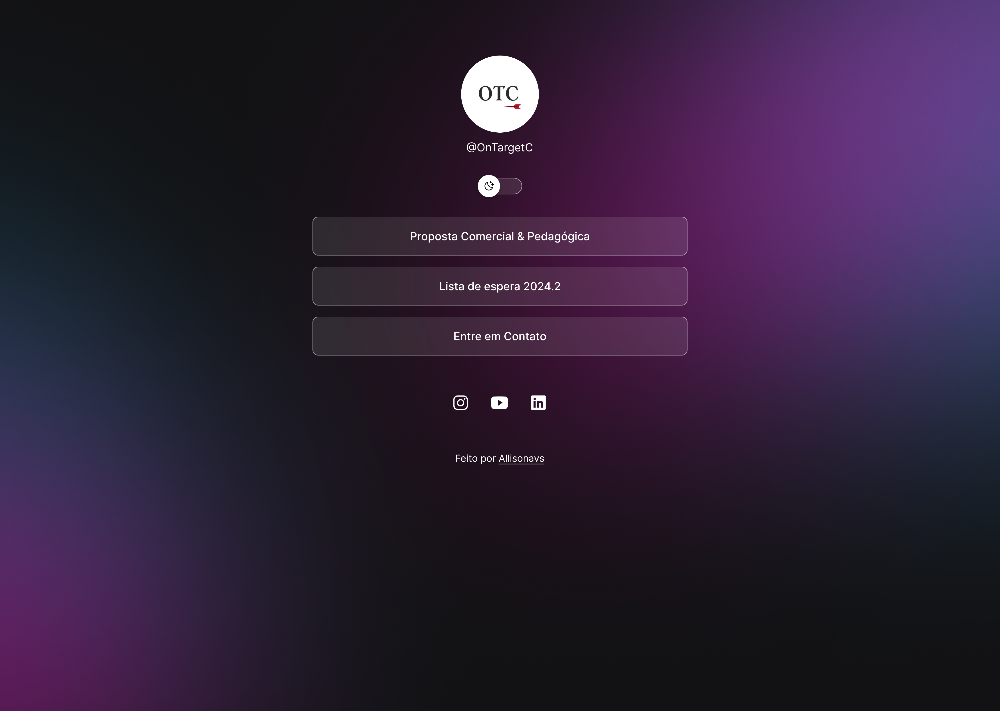

<h1 align="center"> Plataforma de Links </h1>

Um agregador de links responsivo e com troca de tema que você pode usar como cartão de visitas nas suas redes sociais.

 

  
Feito durante o curso da Rocketseat, adaptado para um uso real em uma escola de inglês online
  
 

  <a href="#-tecnologias" target="_blank">Tecnologias</a>&nbsp;&nbsp;&nbsp;|&nbsp;&nbsp;&nbsp;
  <a href="#-projeto" target="_blank">Projeto</a>&nbsp;&nbsp;&nbsp;|&nbsp;&nbsp;&nbsp;
  <a href="#-layout" target="_blank">Layout</a>&nbsp;&nbsp;&nbsp;|&nbsp;&nbsp;&nbsp;
  <a href="#memo-licença" target="_blank">Licença</a>

  

 

  
  

## 🚀 Tecnologias

Esse projeto foi desenvolvido com as seguintes tecnologias:

- HTML e CSS
- JavaScript
- Git e Github
- Figma

## 💻 Projeto

O DevLinks é um agregador de links para usar como cartão de visitas online.

- <a href="https://allisonavs.github.io/Plataforma-de-Links-Discover/" target="_blank">Acesse o projeto finalizado, online</a>

## 🔖 Layout

Você pode visualizar o layout do projeto através 
<a href="https://www.figma.com/file/06ebBLGKzFCb7igTzYxReh/DevLinks-%E2%80%A2-Projeto-Discover-(Community)?type=design&node-id=1670-110&mode=design&t=LbqZNPyTf0G6LRJ9-0" target="_blank">DESSE LINK</a>. É necessário ter conta no <a href="https://figma.com" target="_blank">Figma</a> para acessá-lo.

## :memo: Licença

Esse projeto está sob a licença MIT.

---

Feito por <a href="www.linkedin.com/in/allisonavs" target="_blank">Allisonavs</a>
